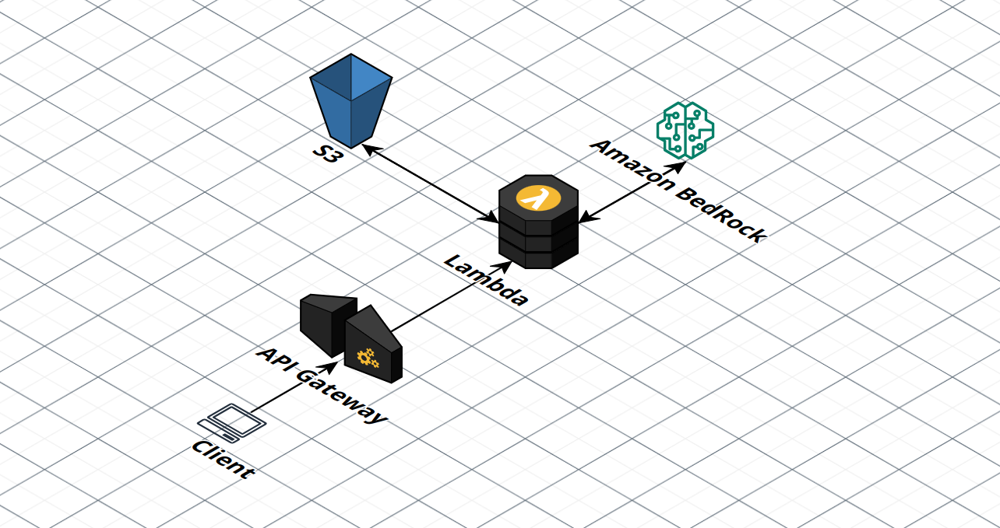
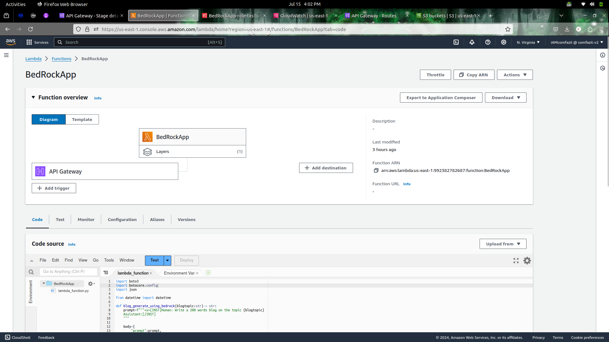
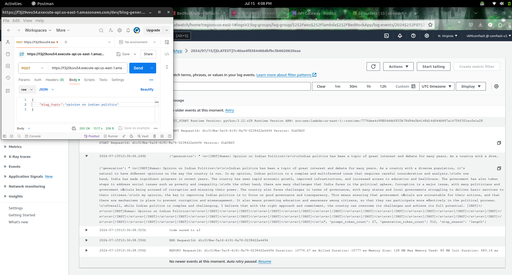

# Blog-Generation-with-AWS

This project demonstrates how to generate blogs using AI by integrating multiple AWS services, including Amazon Bedrock, AWS Lambda, Amazon API Gateway, and Amazon S3. The architecture leverages the "Llama 3-8B" foundational model from Bedrock to generate blog content based on given topics.

## Architecture Diagram
 <!-- Update with the correct path to your uploaded diagram -->

## Project Steps

### Step 0: Request Access to Bedrock
Before you begin, request access to the Bedrock service for the Meta Llama model.

### Step 1: Write Lambda Function
Create a Lambda function that uses the Bedrock foundational model to generate blog content. Ensure to attach the necessary permissions to the Lambda function.

### Step 2: Create an API with POST Method
Using Amazon API Gateway, create an API with a POST method that will trigger the Lambda function.

### Step 3: Integrate the API with Lambda Function
Configure the API Gateway to invoke the Lambda function when the POST method is called.

### Step 4: Test the API with POSTMAN
Use POSTMAN to send POST requests to the API endpoint and verify that the Lambda function is correctly generating the blog content.

### Step 5: Store the Generated Blog in an S3 Bucket
Modify the Lambda function to store the generated blog content in an S3 bucket.

### Step 6: Observe CloudWatch Logs
Monitor CloudWatch logs for detailed execution logs and troubleshooting information.

## Prerequisites
- AWS Account
- Access to Amazon Bedrock
- Basic knowledge of AWS services: Lambda, API Gateway, S3, CloudWatch
- Postman for API testing

## API Configuration
- Create a new REST API in API Gateway.
- Add a POST method to the root resource.
- Set the Integration type to Lambda Function and select the Lambda function created earlier.
- Deploy the API to a stage.

## Testing with Postman
- Open Postman and create a new POST request.
- Set the request URL to your API Gateway endpoint.
- In the body, use JSON format to pass the blog topic:
{
    "blogtopic": "Your Blog Topic"
}
- Send the request and verify the response.

## CloudWatch Logs
Monitor the CloudWatch logs to ensure that the Lambda function executes correctly and for debugging purposes.
